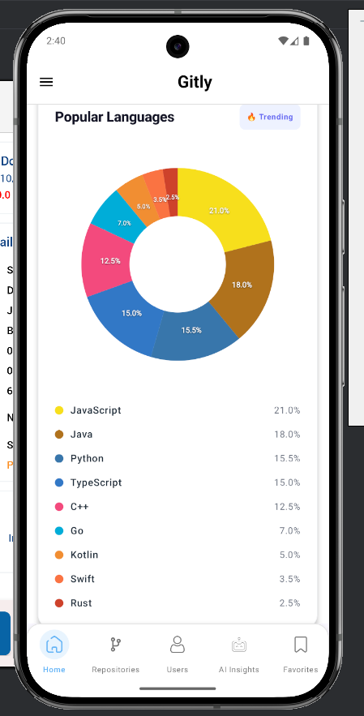
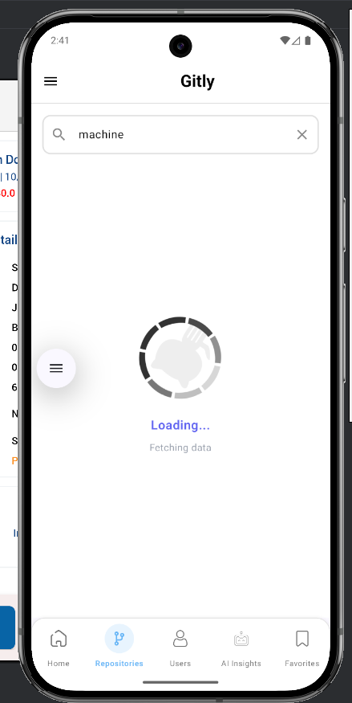
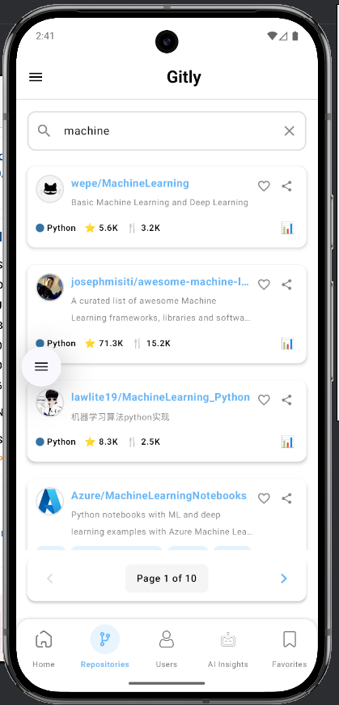
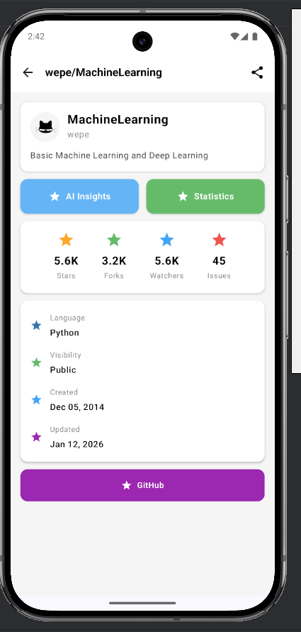
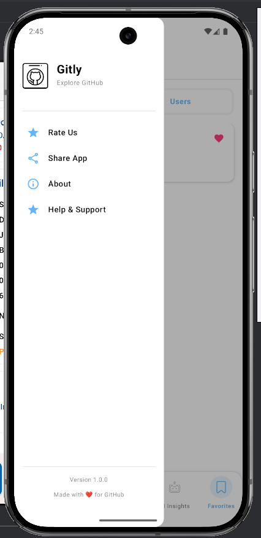

# 🚀 Gitly - GitHub Explorer Application

<div align="center">
  
  
  ### Explore GitHub Like Never Before
  
  A powerful Android application that brings GitHub exploration to your fingertips with AI-powered insights, user analytics, and repository management.
  
  [](https://developer.android.com/)
  [](https://kotlinlang.org/)
  [](https://developer.android.com/jetpack/compose)
  [](LICENSE)
</div>

---

## 📱 Screenshots

<div align="center">
  <table>
    <tr>
      <td align="center">
        <br/>
        <b>Splash Screen</b>
      </td>
      <td align="center">
        <br/>
        <b>Loading Animation</b>
      </td>
      <td align="center">
        <br/>
        <b>Home Screen</b>
      </td>
      <td align="center">
        <br/>
        <b>Help & Guide</b>
      </td>
    </tr>
    <tr>
      <td align="center">
        <br/>
        <b>About GitHub</b>
      </td>
      <td align="center">
        <br/>
        <b>User Search</b>
      </td>
      <td align="center">
        <br/>
        <b>User Profile</b>
      </td>
      <td align="center">
        <br/>
        <b>User Details</b>
      </td>
    </tr>
    <tr>
      <td align="center">
        <br/>
        <b>Repository List</b>
      </td>
      <td align="center">
        <br/>
        <b>AI Chat Interface</b>
      </td>
      <td align="center">
        <br/>
        <b>AI Insights</b>
      </td>
      <td align="center">
        <br/>
        <b>Repository Details</b>
      </td>
    </tr>
    <tr>
      <td align="center">
        <br/>
        <b>Repo Analytics</b>
      </td>
      <td align="center">
        <br/>
        <b>Favorites Page</b>
      </td>
      <td align="center">
        <br/>
        <b>Statistics View</b>
      </td>
      <td align="center">
        <br/>
        <b>GitHub Integration</b>
      </td>
    </tr>
  </table>
</div>

---

## ✨ Features

### 🏠 Home & Exploration
- **GitHub Information Hub** - Comprehensive information about GitHub, its features, and ecosystem
- **Beautiful UI** - Modern Material Design with smooth animations and intuitive navigation
- **Splash Screen** - Elegant entry point with animated loading screen

### 🔍 User Search & Insights
- **Advanced User Search** - Search for any GitHub user with real-time results
- **User Profile Details** - View comprehensive user information including:
  - Profile picture, bio, and location
  - Follower and following counts
  - Public repositories and gists
  - Account creation date and activity
- **User Statistics** - Detailed analytics and contribution insights

### 📦 Repository Management
- **Repository Browser** - Explore user repositories with detailed information
- **Repository Details** - View:
  - Stars, forks, and watchers count
  - Programming languages used
  - Description and README
  - Last updated information
  - Open issues count

### 🤖 Gitly AI (AI-Powered Insights)
- **AI User Analysis** - Generate intelligent insights about GitHub users
- **AI Repository Insights** - Get AI-powered analysis of repositories including:
  - Code quality assessment
  - Technology stack analysis
  - Project recommendations
  - Contribution patterns
- **Interactive Chat** - Chat with AI about GitHub profiles and repositories
- **Smart Recommendations** - AI suggests similar repos and users

### ⭐ Favorites System
- **Save Favorites** - Bookmark your favorite users and repositories
- **Quick Access** - Easy access to saved items
- **Organized Collections** - Manage your favorites efficiently

### 📊 Additional Features
- **Help & Documentation** - In-app guide for all features
- **About Section** - Learn about GitHub and the app
- **Statistics Dashboard** - Visual representation of data
- **Offline Support** - Access cached data without internet

---

## 🏗️ Project Structure

```
gitly/
├── app/
│   ├── src/
│   │   ├── main/
│   │   │   ├── java/com/example/gitly/
│   │   │   │   ├── data/                    # Data layer
│   │   │   │   │   ├── api/                 # API services
│   │   │   │   │   │   ├── GitHubApiService.kt
│   │   │   │   │   │   ├── GraphQLClient.kt
│   │   │   │   │   │   └── RetrofitClient.kt
│   │   │   │   │   ├── local/               # Local database
│   │   │   │   │   ├── model/               # Data models
│   │   │   │   │   └── repository/          # Repository pattern
│   │   │   │   │       ├── FavoritesRepository.kt
│   │   │   │   │       ├── GitHubRepository.kt
│   │   │   │   │       └── SearchResult.kt
│   │   │   │   ├── di/                      # Dependency injection
│   │   │   │   ├── domain/                  # Domain layer
│   │   │   │   │   ├── model/
│   │   │   │   │   ├── repository/
│   │   │   │   │   └── usecase/
│   │   │   │   ├── presentation/            # Presentation layer
│   │   │   │   │   ├── base/
│   │   │   │   │   │   └── BaseViewModel.kt
│   │   │   │   │   ├── components/          # Reusable UI components
│   │   │   │   │   │   └── LoadingScreen.kt
│   │   │   │   │   ├── navigation/          # Navigation setup
│   │   │   │   │   ├── screens/             # All app screens
│   │   │   │   │   │   ├── about/
│   │   │   │   │   │   │   └── AboutScreen.kt
│   │   │   │   │   │   ├── ai_insights/
│   │   │   │   │   │   │   ├── AiChatScreen.kt
│   │   │   │   │   │   │   ├── AiChatViewModel.kt
│   │   │   │   │   │   │   ├── AiInsightScreen.kt
│   │   │   │   │   │   │   └── ExampleQueries.kt
│   │   │   │   │   │   ├── favorites/
│   │   │   │   │   │   ├── help/
│   │   │   │   │   │   ├── home/
│   │   │   │   │   │   ├── repo_detail/
│   │   │   │   │   │   ├── repo_details/
│   │   │   │   │   │   ├── statistics/
│   │   │   │   │   │   └── user_detail/
│   │   │   │   │   │       └── UserProfileDetailScreen.kt
│   │   │   │   │   ├── theme/               # App theming
│   │   │   │   │   └── viewmodel/           # ViewModels
│   │   │   │   │       └── GitlyViewModel.kt
│   │   │   │   ├── util/                    # Utilities
│   │   │   │   └── GItlyApplication.kt      # Application class
│   │   │   └── res/
│   │   │       ├── drawable/                # Images & icons
│   │   │       │   ├── ss1.png - ss15.png   # App screenshots
│   │   │       │   ├── github.png
│   │   │       │   ├── github_icon.png
│   │   │       │   ├── code.png
│   │   │       │   └── fav.png
│   │   │       ├── values/                  # Themes & strings
│   │   │       └── xml/                     # XML resources
│   │   └── schemas/                         # Database schemas
│   └── androidTest/                         # Android tests
└── build.gradle                             # Build configuration
```

---

## 🛠️ Tech Stack

### Core Technologies
- **Language**: Kotlin
- **UI Framework**: Jetpack Compose
- **Architecture**: MVVM (Model-View-ViewModel)
- **Navigation**: Jetpack Navigation Compose

### Libraries & Dependencies
- **Networking**: 
  - Retrofit (REST API)
  - GraphQL Client (GitHub GraphQL API)
  - OkHttp (HTTP client)
- **Async Operations**: Kotlin Coroutines & Flow
- **Dependency Injection**: Hilt/Dagger
- **Image Loading**: Coil
- **Local Storage**: Room Database
- **AI Integration**: Custom AI service integration
- **JSON Parsing**: Gson/Kotlinx Serialization

### Architecture Components
- ViewModel
- LiveData/StateFlow
- Repository Pattern
- Use Cases (Clean Architecture)

---

## 🚀 Getting Started

### Prerequisites
- Android Studio Arctic Fox or later
- JDK 11 or higher
- Android SDK (API level 24+)
- GitHub Personal Access Token (for API access)

### Installation

1. **Clone the repository**
   ```bash
   git clone https://github.com/yourusername/gitly.git
   cd gitly
   ```

2. **Open in Android Studio**
   - Open Android Studio
   - Select "Open an Existing Project"
   - Navigate to the cloned directory

3. **Configure API Keys**
   
   Create a `local.properties` file in the root directory and add:
   ```properties
   GITHUB_TOKEN=your_github_personal_access_token
   AI_API_KEY=your_ai_api_key
   ```

4. **Sync Gradle**
   - Click "Sync Project with Gradle Files"
   - Wait for dependencies to download

5. **Run the Application**
   - Connect an Android device or start an emulator
   - Click the "Run" button or press Shift + F10

---

## 🔑 API Setup

### GitHub Personal Access Token

1. Go to GitHub Settings → Developer settings → Personal access tokens
2. Generate new token with following scopes:
   - `read:user`
   - `repo`
   - `user:email`
3. Copy the token and add it to `local.properties`

### GitHub GraphQL API

The app uses GitHub's GraphQL API for enhanced data fetching. The GraphQL client is configured in `GraphQLClient.kt`.

---

## 📖 How to Use

1. **Launch the App** - Open Gitly on your device
2. **Explore Home** - Learn about GitHub and explore features
3. **Search Users** - Use the search functionality to find GitHub users
4. **View Profiles** - Click on any user to see detailed information
5. **Browse Repositories** - Explore user repositories with full details
6. **Get AI Insights** - Use Gitly AI to get intelligent analysis
7. **Save Favorites** - Add users and repos to your favorites
8. **View Statistics** - Check out detailed analytics and stats

---

## 🎨 Design Highlights

- **Material Design 3** - Modern, beautiful UI components
- **Dark/Light Theme** - Automatic theme switching
- **Smooth Animations** - Delightful user experience
- **Intuitive Navigation** - Easy-to-use bottom navigation
- **Responsive Layout** - Optimized for different screen sizes
- **Custom Icons** - Unique icon set for better recognition

---

## 🤝 Contributing

Contributions are welcome! Here's how you can help:

1. Fork the repository
2. Create a feature branch (`git checkout -b feature/AmazingFeature`)
3. Commit your changes (`git commit -m 'Add some AmazingFeature'`)
4. Push to the branch (`git push origin feature/AmazingFeature`)
5. Open a Pull Request

### Contribution Guidelines
- Follow Kotlin coding conventions
- Write clean, documented code
- Add unit tests for new features
- Update README if needed

---

## 🐛 Bug Reports

Found a bug? Please open an issue with:
- Description of the bug
- Steps to reproduce
- Expected behavior
- Screenshots (if applicable)
- Device and Android version

---

## 📄 License

This project is licensed under the MIT License - see the [LICENSE](LICENSE) file for details.

---

## 👨‍💻 Author

**Your Name**
- GitHub: [@yourusername](https://github.com/yourusername)
- Email: your.email@example.com

---

## 🙏 Acknowledgments

- GitHub API for providing comprehensive developer data
- Material Design team for design guidelines
- Jetpack Compose team for modern UI toolkit
- AI service providers for intelligent insights
- Open source community for inspiration

---

## 📞 Support

Need help? Have questions?

- 📧 Email: support@gitly.app
- 💬 Discord: [Join our server](https://discord.gg/gitly)
- 🐦 Twitter: [@GitlyApp](https://twitter.com/gitlyapp)
- 📖 Documentation: [docs.gitly.app](https://docs.gitly.app)

---

## 🗺️ Roadmap

### Upcoming Features
- [ ] GitHub trending repositories
- [ ] Organization exploration
- [ ] Pull request tracking
- [ ] Code snippet viewer
- [ ] Contribution heatmap
- [ ] Repository comparison
- [ ] Advanced filters and sorting
- [ ] Export data functionality
- [ ] Widget support
- [ ] Multiple account support

---

## 📊 Project Stats

- **Total Lines of Code**: 10,000+
- **Languages**: Kotlin, XML
- **Components**: 50+ screens and components
- **API Integrations**: GitHub REST API, GitHub GraphQL API, AI Services
- **Supported Android Versions**: 7.0 (API 24) and above

---

<div align="center">
  
  ### ⭐ If you like Gitly, give it a star!
  
  Made with ❤️ by developers, for developers
  
  **[Download APK](releases)** | **[View Documentation](docs)** | **[Report Issue](issues)**
  
</div>

---

## 📸 Additional Screenshots

### Feature Highlights

| Feature | Screenshot | Description |
|---------|------------|-------------|
| User Search | `ss6.png` | Powerful search with auto-suggestions |
| AI Insights | `ss10.png`, `ss11.png` | Get intelligent analysis of users and repos |
| Repository Details | `ss12.png`, `ss13.png` | Comprehensive repo information |
| Favorites | `ss14.png` | Manage your bookmarked items |
| Statistics | `ss15.png` | Visual data representation |

---

## 🔐 Privacy & Security

Gitly respects your privacy:
- No personal data collection
- GitHub token stored securely
- All data encrypted
- Open source and transparent
- No third-party tracking

---

## 💡 Tips & Tricks

1. **Quick Search**: Use the search bar on home screen for instant results
2. **Swipe Gestures**: Swipe between screens for smooth navigation
3. **Long Press**: Long press on items for additional options
4. **AI Chat**: Ask specific questions for better AI insights
5. **Refresh Data**: Pull down to refresh user and repo information

---

<div align="center">
  <p>
    <sub>Built with passion using Kotlin & Jetpack Compose</sub>
  </p>
  <p>
    <sub>© 2024 Gitly. All rights reserved.</sub>
  </p>
</div>
